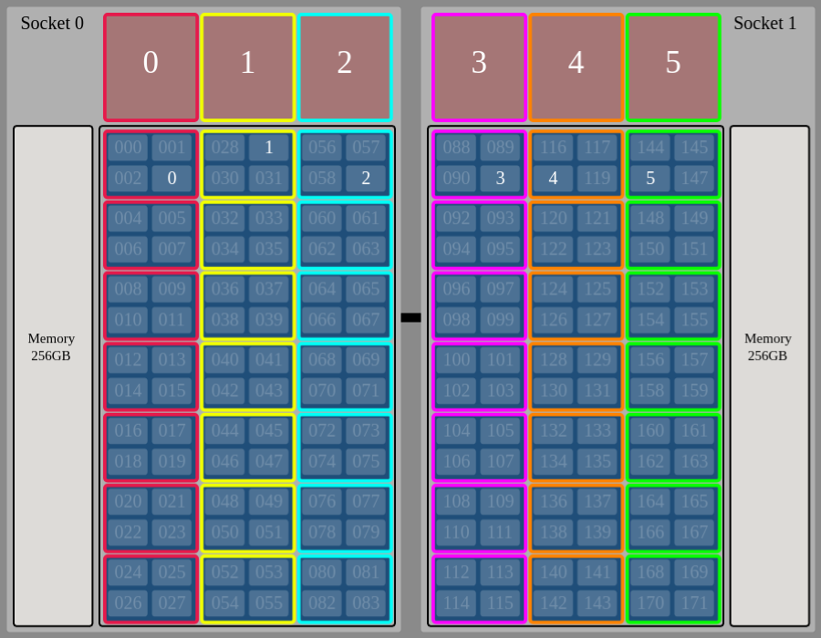

.. highlight:: bash

Managing Jobs at OLCF
=====================

Titan
-----

.. note::

   Titan is gone, so we need to update these instructions for Summit

On Titan, we have a PBS script ``titan.run`` and a script
``process.titan`` executed by ``titan.run`` to tar up plot,
checkpoint, and diagnostic files and store them in HPSS.

These are here: `<https://github.com/AMReX-Astro/workflow/tree/master/job_scripts/titan>`_

The ``process.titan`` script relies on ``ftime``, an AMReX plotfile
tool that prints the simulation time for a given plotfile.

You can build ``ftime`` (tested with GNU) in ``amrex/Tools/Plotfile``,
copy it into the run directory, and set ``FTIME_EXE`` appropriately in
``process.titan``. If compiled with GNU, then the ``PrgEnv-gnu``
module should be loaded when you submit the ``titan.run`` PBS script.

These scripts will automatically create a directory with the same name
as your run directory on HPSS where files will be archived.

To have a look, use the ``hsi`` command to browse HPSS.

Files may be unarchived in bulk from HPSS on OLCF systems using the
``hpss_xfer.py`` script, which is available in the job_scripts
directory. It requires Python 3 to be loaded to run. The command::

    ./hpss_xfer.py plt00000 -s hpss_dir -o plotfile_dir

will fetch ``hpss_dir/plt00000.tar`` from the HPSS filesystem and
unpack it in ``plotfile_dir``. If run with no arguments in the problem
launch directory, the script will attempt to recover all plotfiles
archived by ``process.titan``. Try running :code:`./hpss_xfer.py --help`
for a description of usage and arguments.

For more information about using HPSS on Titan see `<https://www.olcf.ornl.gov/for-users/system-user-guides/titan/titan-user-guide/#workflow>`_

.. note::

   *Error: aprun not found*

   It is possible (on Titan) that some aspect of the environment on job
   submission can lead to the job failing with the following error::

     XALT Error: unable to find aprun

   Bill Renaud at OLCF advised adding the `-l` shell argument in the
   script shebang line. This did not work for the `ksh` shell but does
   work for `bash` as::

       #!/bin/bash -l

   This allows the job to run for the PBS script submitted from either
   `bash` or `zsh`.

Summit
------

On Summit, we have a few different examples of PBS batch
scripts. ``run_amrex_gpu_tutorials.summit`` is a shallow copy of the
`AMReX tutorial script
<https://github.com/AMReX-Codes/amrex/blob/development/Tutorials/GPU/run.summit>`_,
and is more verbose about what different flags and options will do.
The Castro GPU batch script example is ``summit_16nodes.sh``, more job
script examples for Castro can be found `here
<https://github.com/AMReX-Astro/Castro/tree/master/Util/scaling/sedov/summit_201905>`_.
The Nyx example shows running MPI+CUDA, MPI+CUDA with one mpi process
nvvp output, and MPI+OMP
``run_3_tests_same_node.summit``. ``run_template.summit`` gives
example syntax for jsrun:

.. literalinclude:: ../../job_scripts/summit/run_template.summit
		    :language: sh
		    :emphasize-lines: 14-20,34-42
		    :linenos:

This can be visualized using `<https://jsrunvisualizer.olcf.ornl.gov/index.html>`_

.. |a| image:: ./figs/jsrunVisualizer-MPI+OMP.png
       :width: 100%

.. _fig:gpu:threads:

.. table:: Comparison of jsrun process assignment for MPI + OpenMP and MPI + GPU work distribution.

	   +-----------------------------------------------------+------------------------------------------------------+
	   |                        |a|                          |                        |b|                           |
	   +-----------------------------------------------------+------------------------------------------------------+
	   | | MPI + OpenMP                                      | | MPI + GPU                                          |
	   +-----------------------------------------------------+------------------------------------------------------+

The example script directory is: `<https://github.com/AMReX-Astro/workflow/tree/master/job_scripts/summit>`_

.. note::

   We are defaulting to one hardware thread per CPU, since this is the configuration suggested by OLCF

Submitting and monitoring
^^^^^^^^^^^^^^^^^^^^^^^^^

Jobs are submitted using the ``bsub`` command::

  bsub script.sh

You can monitor the status of your jobs using ``bjobs``.

A slightly nicer view of your jobs can be viewed using ``jobstat`` as::

  jobstat -u username

Archiving to HPSS
-----------------

You can submit jobs to the data transfer nodes (dtn) directly from
Summit using::

  sbatch -N 1 -t 15:00 -A ast106 --cluster dtn test_hpss.sh

This uses ``slurm`` as the job manager.  An example script
that uses the ``process.xrb`` looks like::

  #!/bin/bash
  #SBATCH -A ast106
  #SBATCH -t 02:00:00
  #SBATCH --cluster dtn
  #SBATCH -N 1

  # do our archiving
  pidfile=process.pid

  cd $SLURM_SUBMIT_DIR

  ./process.xrb

  PID=$!
  trap 'kill -s TERM $PID' EXIT TERM HUP XCPU KILL

  rm -f process.pid
