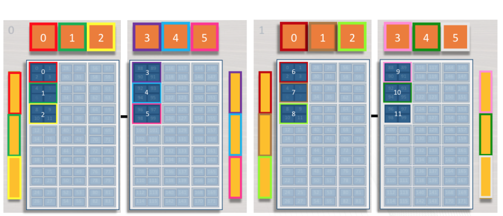

.. highlight:: bash

Managing Jobs at OLCF
=====================

Summit
------

Summit Arquitecture:
^^^^^^^^^^^^^^^^^^^^

Let us start by reviewing the node architecture of Summit. Our goal is to provide the necessary insight to make better
decisions in the construction of our particular AMReX-Astro job scripts, and to explain how our code interacts with Summit.
All the exposed information in this section is a condensed version of the `Summit documentation guide
<https://docs.olcf.ornl.gov/systems/summit_user_guide.html#job-launcher-jsrun>`_, and should not replace it.

In Summit, a node is composed by two sockets: each one with 21 CPU physical cores (+1 reserved for the system), 3 GPU's and 1 RAM memory bank.
The sockets are connected by a bus allowing communication among them. Each CPU physical core may define up to 4 threads.
The whole structure of the node can be depicted as follows:

.. figure:: ./figs/summit-node-description-1.png
   :width: 100%
   :align: center

   Figure extracted from ``https://docs.olcf.ornl.gov/systems/summit_user_guide.html#job-launcher-jsrun``.

A resource set is a minimal collection of CPU physical cores and GPU's, on which a certain number of MPI processes and OpenMP
threads operates through the execution of the code. Therefore, for each resource set, we neet to allocate:

- A number of CPU physical cores.

- A number of physical GPU's.

- A number of MPI processes.

- A number of OpenMP threads.

where each core supports up to 4 threads; however, this option is not supported in AMReX and we will not extend our
discussion here. For now, we fix just only one thread through the whole execution of our code. The next step is to determine the maximum
number of resource sets that may fit into one node.

In Castro we construct each resource set with: 1 CPU physical core, 1 GPU, and only 1 MPI process.
The next step is to see how many resources sets fits into one node. Acording to the node architecture depicted in Figure 1,
we can fit up to 6 resource sets per node as in Figure 2.

   Figure modified and extracted from ``https://docs.olcf.ornl.gov/systems/summit_user_guide.html#job-launcher-jsrun``.

Requesting Allocation:
^^^^^^^^^^^^^^^^^^^^^^

To allocate the resource sets we need to summon the command ``bsub`` in addition to some flags:

.. list-table:: Title
   :widths: 25 75
   :header-rows: 1

   * - Flag
     - Description

   * - ``-nnodes``
     - allocates the number of nodes we need to run our code. Is important to perform the calculation
       described in the previous section to select the correct number of nodes in our setup.

   * - ``-W``
     - allocates the walltime of the selected nodes. The format we use in Summit is [hours:]minutes, there is
       no room for seconds in Summit. The maximum walltime that we can request is 03:00 (three hours).

   * - ``-alloc_flags``
     - allocates the maximum number of threads available per CPU core. By default the option is ``smt4`` that
       allows 4 threads per core. However, since we will consider only one thread through the whole execution
       we will setup the option ``stm1``. Also ``-alloc_flags`` stands for more options, however we are only
       interested in the one discussed before.

   * - ``-J``
     - defines the name of the allocation. The value ``%J`` correspond to the allocation ID number.

   * - ``-o``
     - defines the **output name that contains the standard output stream**, after running all the jobs inside the requested
       allocation.

   * - ``-e``
     - defines the **output file name containing the standard error stream**, similar to the ``-o`` flag. If ``-e`` is not supplied, then
       the ``-o`` option is assumed by default.

   * - ``-q``
     - defines the queue on which our application will run. There are several options, however, we alternate
       between two options: the standard production queue ``batch`` and the debugging queue ``debug``. The ``debug`` queue is designed
       to allocate an small number of nodes in order to see that our code is running smoothly without bugs.

   * - ``-Is``
     - flags for interactive job followed by the shell name. The Unix bash shell option is ``/bin/bash``. This flag is very useful
       for debugging, because the standard output can be checked as the code is running. Is important to mention that any interactive
       job can only be summoned by command line and not by running a bash script.

For example, if we want to allocate one node to run an interactive job in the debug queue for 30 minutes we may setup:

.. prompt:: bash

   bsub -nnodes 1 -q debug -W 0:30 -P ast106 -alloc_flags smt1 -J example -o stdout_to_show.%J -e stderr_to_show.%J -Is /bin/bash

.. note::

   An interactive job can only be allocated by the use of the command line. No script can be defined for interactive jobs.

Submitting a Job:
^^^^^^^^^^^^^^^^^

Once our allocation is granted, is important to load the same modules used in the compilation process of the executable and
export the variable ``OMP_NUM_THREADS`` to setup the number of threads per resource set.

In Castro, we have used the following modules:

.. code-block::

   module load gcc/10.2.0
   module load cuda/11.5.2
   module load python

and fixed only one thread per resource set by:

.. code-block::

   export OMP_NUM_THREADS = 1

The next step is to submit our job. The command `jsrun`, provided with the *total number of resource sets*, the
*number of CPU physical cores per resource set*, *the number of GPU's per resource set*, *the number of MPI processes allocated per resource set*,
works as follows:

.. prompt:: bash

   jsrun -n[number of resource sets] -c[number of CPU physical cores] -g[number of GPU's] -a[number of MPI processes] -r[number of max resources per node] ./[executable] [executable inputs]

In Castro we will use:

.. prompt:: bash

   jsrun -n [number of resource sets] -a1 -c1 -g1 -r6 ./$CASTRO $INPUTS

where the ``CASTRO`` and ``INPUTS`` enviroment variables are placeholders to the executable and input file names respectively.

Now, in order to use all the resources we have allocated to run our jobs, the number of resource sets should match the number of AMReX boxes (grids)
of the corresponing level with the biggest number of them. Let us consider an extract piece from a Castro problem standard output:

.. code-block::

   INITIAL GRIDS
   Level 0   2 grids  32768 cells  100 % of domain
             smallest grid: 128 x 128  biggest grid: 128 x 128
   Level 1   8 grids  131072 cells  100 % of domain
             smallest grid: 128 x 128  biggest grid: 128 x 128
   Level 2   8 grids  524288 cells  100 % of domain
             smallest grid: 256 x 256  biggest grid: 256 x 256
   Level 3   32 grids  2097152 cells  100 % of domain
             smallest grid: 256 x 256  biggest grid: 256 x 256
   Level 4   128 grids  7864320 cells  93.75 % of domain
             smallest grid: 256 x 128  biggest grid: 256 x 256
   Level 5   480 grids  30408704 cells  90.625 % of domain
             smallest grid: 256 x 128  biggest grid: 256 x 256

In this example, Level 5 contains the biggest number of AMReX boxes: 480. From here, we may assert that a good allocation for this problem are
480 resource sets, equivalent to 80 nodes by setting 6 resources per node. However, note that that Level 0 uses only 2 AMReX boxes, this implies that
from the 480 resources available, 398 resources will remain idle until the two working processes sweep the entire Level 0.

.. note::

   Therefore, is important, if possible, to keep the number of boxes
   on each level balanced to maximize the use of the allocated resources.

Writting a Job Script:
^^^^^^^^^^^^^^^^^^^^^^

In order to make our life easier, instead of submitting an allocation command line, loading the modules and threads, and writing another command line
to submit our jobs, we can make an script to pack all these command into one executable ``.sh`` file, that can be submitted via ``bsub`` just once.

We start our job script, summoning the shell with the statement ``!/bin/bash``. Then we add the ``bsub`` allocations flags, starting with ``#BSUB``
as follows:

.. code-block:: bash

   #!/bin/bash
   #BSUB -P ast106
   #BSUB -W 2:00
   #BSUB -nnodes 80
   #BSUB -alloc_flags smt1
   #BSUB -J luna_script
   #BSUB -o luna_output.%J
   #BSUB -e luna_sniffing_output.%J

In addition we add the modules statements, fix only one thread per resource set by:

.. code-block::

   module load gcc/10.2.0
   module load cuda/11.5.2
   module load python

   export OMP_NUM_THREADS = 1

and define the enviroment variables:

.. code-block::

   CASTRO = ./Castro2d.gnu.MPI.CUDA.ex
   INPUTS

   n_res = 480                # The max allocated number of resource sets is
   n_cpu_cores_per_res = 1    # nnodes * n_max_res_per_node. In this case we will
   n_mpi_per_res = 1          # use all the allocated resource sets to run the job
   n_gpu_per_res = 1          # below, however we can define more enviroment
   n_max_res_per_node = 6     # variables to allocate two jobs simultaneous jobs,
                              # where n_res = n_res_1 + n_res2 .

Once the allocation ends, the job is killed, leaving us as we started. As we pointed out, the maximum allocation
time in Summit is 03:00 (three hours), however, we may need sometimes weeks, months, or maybe years to complete
our runs. This is where the automatic restarting section of the script comes to our salvation.

From here we can add an optional (actually, is a mandatory) setting to our script. As the code executes,
after a certain number of timesteps, the code creates checkpoint files of the form ``chkxxxxxxx``, ``chkxxxxxx``
or ``chkxxxxx``. This checkpoint files can be read by our executable and run from the simulation time where
the checkpoint was created. This is implemented as follows:

.. code-block::

   function find_chk_file {
      # find_chk_file takes a single argument -- the wildcard pattern
      # for checkpoint files to look through
      chk=$1

      # find the latest 2 restart files.  This way if the latest didn't
      # complete we fall back to the previous one.
      temp_files=$(find . -maxdepth 1 -name "${chk}" -print | sort | tail -2)
      restartFile=""
      for f in ${temp_files}
      do
         # the Header is the last thing written -- check if it's there, otherwise,
         # fall back to the second-to-last check file written
         if [ ! -f ${f}/Header ]; then
            restartFile=""
         else
            restartFile="${f}"
         fi
      done

   }

   # look for 7-digit chk files
   find_chk_file "*chk???????"

   if [ "${restartFile}" = "" ]; then
      # look for 6-digit chk files
      find_chk_file "*chk??????"
   fi

   if [ "${restartFile}" = "" ]; then
      # look for 5-digit chk files
      find_chk_file "*chk?????"
   fi

   # restartString will be empty if no chk files are found -- i.e. new run
   if [ "${restartFile}" = "" ]; then
      restartString=""
   else
      restartString="amr.restart=${restartFile}"
   fi

The function ``find_chk_file`` searches the submission directory for
checkpoint files.  Because AMReX appends digits as the number of steps
increase (with a minimum of 5 digits), we search for files with
7-digits, 6-digits, and then finally 5-digits, to ensure we pick up
the latest file.

Finally, we run our job with the statement

.. code-block::

   jsrun -n$n_res -c$n_cpu_cores_per_res$ -a$mpi_per_res -g$n_gpu_per_res -r$n_max_res_per_node ./$CASTRO $INPUTS ${restartString}

Finally, once the script is completed and saves as ``luna_script.sh``, we can submit it by:

.. prompt:: bash

   bsub luna_script.sh

Monitoring a Job:
^^^^^^^^^^^^^^^^^

You can monitor the status of your jobs using ``bjobs``. Also, a slightly nicer view of your jobs can be viewed using ``jobstat`` as:

.. prompt:: bash

   jobstat -u username

Script Template:
^^^^^^^^^^^^^^^^

Packing all the information before, lead us to the following script template

.. literalinclude:: ../../job_scripts/summit/summit_template.sh
   :language: sh
   :linenos:

Chaining jobs
^^^^^^^^^^^^^

The script ``job_scripts/summit/chain_submit.sh`` can be used to setup job dependencies,
i.e., a job chain.

First you submit a job as usual using ``bsub``, and make note of the
job-id that it prints upon submission (the same id you would see with
``bjobs`` or ``jobstat``).  Then you setup N jobs to depend on the one
you just submitted as:

.. prompt:: bash

   chain_submit.sh job-id N submit_script.sh

where you replace ``job-id`` with the id return from your first
submission, replace ``N`` with the number of additional jobs, and
replace ``submit_script`` with the name of the script you use to
submit the job.  This will queue up N additional jobs, each depending
on the previous.  Your submission script should use the automatic
restarting features discussed above.

Crusher
-------

The following batch script will run on 1 GPU

.. literalinclude:: ../../job_scripts/crusher/crusher.slurm

or for 8 GPUs on 1 node, the following script works:

.. literalinclude:: ../../job_scripts/crusher/crusher_8gpu.slurm

for interactive:

.. prompt:: bash

   salloc -A ast136_crusher -J amrex -t 00:30:00 -p batch -N 1

then you can run your jobs directly on the compute node.

For debugging:

.. prompt:: bash

   rocgdb --args ./Castro2d.hip.x86-trento.MPI.HIP.ex inputs_2d.testsuite

then do ``run`` at the debugger prompt.

Archiving to HPSS
-----------------

You can access HPSS from submit using the data transfer nodes by submitting a job
via SLURM:

.. prompt:: bash

   sbatch -N 1 -t 15:00 -A ast106 --cluster dtn test_hpss.sh

where ``test_hpss.sh`` is a SLURM script that contains the ``htar``
commands needed to archive your data.  This uses ``slurm`` as the job
manager.

An example is provided by the ``process.xrb`` archiving script and
associated ``summit_hpss.submit`` submission script in
``jobs_scripts/summit/``.  Together these will detect new plotfiles as
they are generated, tar them up (using ``htar``) and archive them onto
HPSS.  They will also store the inputs, probin, and other runtime
generated files.  If ``ftime`` is found in your path, it will also
create a file called ``ftime.out`` that lists the simulation time
corresponding to each plotfile.

Once the plotfiles are archived they are moved to a subdirectory under
your run directory called ``plotfiles/``.

To use this, we do the following:

#. Enter the HPSS system via ``hsi``

#. Create the output directory -- this should have the same name as the directory
   you are running in on summit

#. Exit HPSS

#. Launch the script via:

   .. prompt:: bash

      sbatch summit_hpss.submit

   It will for the full time you asked, searching for plotfiles as
   they are created and moving them to HPSS as they are produced (it
   will always leave the very last plotfile alone, since it can't tell
   if it is still being written).

Files may be unarchived in bulk from HPSS on OLCF systems using the
``hpss_xfer.py`` script, which is available in the job_scripts
directory. It requires Python 3 to be loaded to run. The command:

.. prompt:: bash

   ./hpss_xfer.py plt00000 -s hpss_dir -o plotfile_dir

will fetch ``hpss_dir/plt00000.tar`` from the HPSS filesystem and
unpack it in ``plotfile_dir``. If run with no arguments in the problem
launch directory, the script will attempt to recover all plotfiles
archived by ``process.titan``. Try running :code:`./hpss_xfer.py --help`
for a description of usage and arguments.
